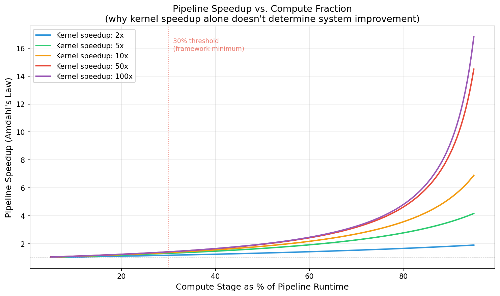
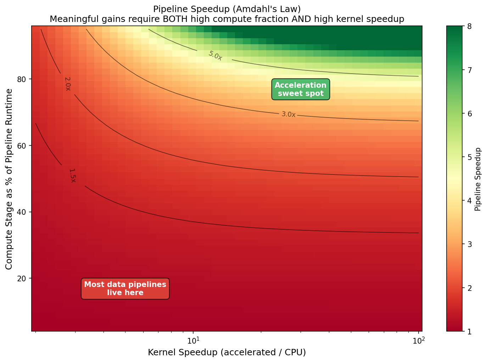

# Acceleration Decision Framework

**When hardware acceleration belongs in a data pipeline — and when it doesn't.**

---

## 1. Prerequisites: Before You Read This

This framework assumes you have already:

- **Profiled your pipeline end-to-end** under representative production load (not synthetic benchmarks, not unit tests, not "it feels slow").
- **Identified a specific stage** that you believe is a candidate for acceleration.
- **Quantified that stage's contribution** to total pipeline wall-clock time — not just its CPU time, but its share of the end-to-end latency including upstream and downstream coupling.

If you have not done these things, this framework will not help you. Go instrument your pipeline first. The most common outcome of proper profiling is discovering that the bottleneck is not where you thought it was.

---

## 2. The Acceleration Spectrum

Hardware acceleration is not a binary decision between "CPU" and "FPGA." It is a spectrum of increasing specialization, increasing performance potential, and increasing integration cost:

```
Algorithmic     →    SIMD/      →    GPU       →    FPGA      →    ASIC
Optimization         Vectorization   (CUDA/OpenCL)   (HLS/RTL)      (Custom Silicon)
                                                  
Low complexity                                                  High complexity
Low integration cost                                            High integration cost  
High flexibility                                                Low flexibility
Low peak performance                                            Highest peak performance
```

Each step right on this spectrum buys you:
- **Higher peak throughput** for workloads that match the hardware's execution model.
- **Better performance per watt** (increasingly important at scale).

Each step right also costs you:
- **Integration effort** — more engineering time to build, test, and deploy.
- **Team cognitive load** — fewer engineers can debug, modify, or reason about the accelerated path.
- **Operational rigidity** — harder to change, harder to instrument, harder to roll back.
- **Vendor exposure** — deeper dependency on a specific vendor's toolchain, runtime, and roadmap.

The framework's recommendation: **move right along this spectrum only when you have evidence that the current position is insufficient, and only one step at a time.**

---

## 3. Amdahl's Law in Practice

Before evaluating any acceleration candidate, apply Amdahl's Law honestly.

If a stage represents fraction `f` of your pipeline's total runtime, and you accelerate that stage by factor `S`, the maximum pipeline speedup is:

```
Pipeline Speedup = 1 / ((1 - f) + f/S)
```

**Practical implications:**

| Stage fraction (f) | Kernel speedup (S) | Pipeline speedup |
|---|---|---|
| 10% | 10x | 1.10x |
| 10% | 100x | 1.11x |
| 30% | 10x | 1.37x |
| 50% | 10x | 1.82x |
| 70% | 10x | 2.94x |
| 90% | 10x | 5.26x |

The table makes the point starkly: **accelerating a stage that represents less than 30% of your pipeline's runtime will not produce meaningful system-level gains, regardless of how fast the accelerator is.**

Think of it like upgrading the engine in a car that spends 90% of its time stuck in traffic. The engine isn't the bottleneck — the road is.

This is the single most common analytical failure in acceleration proposals. Teams measure kernel throughput, report impressive speedup numbers, and then discover that the pipeline barely got faster.





---

## 4. Decision Criteria

For each candidate stage in your pipeline, evaluate the following criteria. These are ordered by elimination efficiency — the first criterion that fails should end the evaluation.

### 4.1 Compute Density

**Question:** Is the candidate stage dominated by arithmetic operations on data that is already in memory, with minimal branching and minimal data-dependent control flow?

**Why it matters:** Accelerators (GPUs and FPGAs alike) achieve their throughput advantages through parallelism and pipelining. Both are defeated by irregular branching, pointer chasing, and data-dependent control flow. If your hot path is "iterate over a hash map and conditionally update nested structures," no accelerator will help meaningfully.

**Good candidates:** Matrix operations, bitfield packing/unpacking, fixed-format parsing, checksum computation, compression, signal filtering, regular-expression matching on fixed patterns.

**Poor candidates:** Graph traversal, recursive schema validation, business-rule evaluation with many branches, anything dominated by memory-random-access patterns.

### 4.2 Data Transfer Overhead

**Question:** What fraction of the accelerated stage's wall-clock time will be spent moving data to and from the accelerator, relative to the compute itself?

**Why it matters:** This is the single most common reason acceleration projects fail to deliver expected speedups. For GPUs, this is PCIe transfer time plus kernel launch overhead. For FPGAs, this is DMA setup, host-to-device marshalling, and result retrieval. For cloud FPGA instances (e.g., AWS F-series), add network and hypervisor overhead.

**Rule of thumb (not a substitute for measurement):** If the compute kernel runs in less than ~1ms, the overhead of dispatching to a discrete accelerator will likely dominate. Batching can amortize this, but batching adds latency and complicates failure handling.

**The honest calculation:**

```
Effective speedup = T_cpu / (T_transfer_to + T_compute_accelerator + T_transfer_from + T_overhead)
```

If `T_transfer_to + T_transfer_from + T_overhead` exceeds `T_compute_accelerator`, you have built an expensive data-shuffling system.


See [`tools/crossover_analysis.py`](../tools/crossover_analysis.py) for an interactive exploration of how transfer overhead, batch size, and kernel speedup interact.

### 4.3 Pipeline Position

**Question:** Where in the pipeline does the candidate stage sit, and what are the upstream/downstream coupling constraints?

**Why it matters:** A stage at the beginning of a pipeline (e.g., ingestion parsing) has different integration constraints than a stage in the middle (e.g., feature transformation) or at the end (e.g., output encoding). Early stages often need to handle irregular, untrusted input. Late stages often need to produce output in a specific format for downstream consumers. Middle stages are often the best acceleration candidates because their input and output contracts are well-defined.

**Consideration matrix:**

| Pipeline Position | Typical Characteristics | Acceleration Suitability |
|---|---|---|
| Ingestion / Parsing | Irregular input, error handling, schema validation | Low — control-flow heavy, high branching |
| Transformation / Compute | Well-defined input/output, compute-intensive | Highest — most amenable to offload |
| Serialization / Output | Format compliance, ordering guarantees | Moderate — depends on format regularity |
| Orchestration / Scheduling | Coordination, dependency resolution | None — not a compute problem |

### 4.4 Failure and Fallback

**Question:** What happens when the accelerator is unavailable, returns incorrect results, or exceeds its latency budget?

**Why it matters:** In production data pipelines, failure handling is not optional. Accelerators introduce failure modes that do not exist in CPU paths: driver crashes, device memory exhaustion, thermal throttling, bitstream corruption (FPGAs), CUDA context errors (GPUs), and cloud instance preemption.

**Minimum requirements for production:**
- A CPU fallback path that produces bit-identical results (or documented acceptable deviation).
- Health checking that detects accelerator degradation before it causes pipeline failure.
- Metrics that distinguish between accelerator failures and application-level errors.
- A deployment mechanism that can disable the accelerated path without redeploying the pipeline.

If you cannot build and maintain a CPU fallback path, you have made the accelerator a single point of failure in your pipeline. Assess whether that risk is acceptable for your SLA.

### 4.5 Team and Organizational Readiness

**Question:** Can your team build, debug, deploy, and maintain the accelerated path without creating a single-person dependency?

**Why it matters:** This is not a technical criterion. It is an organizational one, and it is frequently the actual reason acceleration projects fail.

FPGA development requires HLS or RTL expertise. GPU development requires CUDA/OpenCL proficiency and understanding of GPU memory hierarchies. Both require understanding of host-device communication, DMA, and debugging across hardware-software boundaries.

If one engineer on your team has this expertise and nobody else does, you have created a critical single-person dependency. When that person is on vacation, changes teams, or leaves the company, the accelerated path becomes unmaintainable.

**Minimum viable team for production acceleration:** At least 2 engineers who can independently modify, debug, and deploy the accelerated path. This is not a nice-to-have — it is a prerequisite.

### 4.6 Return on Integration Investment

**Question:** Does the performance gain justify the total integration cost — not just the hardware cost, but the engineering time, operational complexity, and ongoing maintenance?

**Why it matters:** See the [Integration Cost Model](integration-cost-model.md) for a full taxonomy. The short version: kernel implementation is typically 15–30% of the total integration effort. The remaining 70–85% is data marshalling, error handling, testing infrastructure, CI/CD integration, observability, and documentation.

---

## 5. Decision Tree

Apply these criteria in order. The first "No" should end the evaluation.

```
  Is the bottleneck measured and confirmed as compute-bound?
  ├─ No  → Stop. Profile first.
  └─ Yes ↓

  Have algorithmic optimizations been attempted?
  ├─ No  → Stop. Optimize first. Re-evaluate after.
  └─ Yes ↓

  Is the workload high compute density (parallel, regular, minimal branching)?
  ├─ No  → Stop. Acceleration will underperform expectations.
  └─ Yes ↓

  Is data transfer overhead < 30% of projected accelerated compute time?
  ├─ No  → Investigate batching or co-located acceleration. If still no → Stop.
  └─ Yes ↓

  Can you build a CPU fallback path and test both paths in CI?
  ├─ No  → Stop. Operational risk is too high.
  └─ Yes ↓

  Can ≥2 engineers maintain the accelerated path?
  ├─ No  → Stop. Organizational risk is too high.
  └─ Yes ↓

  Does the ROI justify the integration cost (see cost model)?
  ├─ No  → Stop. Revisit when workload grows or costs change.
  └─ Yes ↓

  Proceed with acceleration. Start with the least-specialized option
  on the spectrum that meets your throughput requirement.
  (SIMD before GPU. GPU before FPGA. FPGA before ASIC.)
```

---

## 6. When FPGAs Specifically Make Sense

Given the spectrum above, FPGAs occupy a narrow but real niche. They are the right choice when **all** of the following are true:

1. **GPU is insufficient or unsuitable.** The workload requires either bit-level manipulation, deterministic latency (not throughput-optimized), custom protocol handling, or inline processing (network-attached acceleration) that GPU kernel launch overhead precludes.

2. **The workload is stable.** FPGA development cycles are long relative to software. If the compute kernel's requirements change quarterly, FPGA reimplementation will not keep pace.

3. **Volume justifies the tooling investment.** FPGA toolchains (Vivado, Quartus, Vitis HLS) are complex, slow to compile, and require specialized expertise. This investment is justified at scale — either high data volume or high per-record value.

4. **The deployment environment supports it.** Either you have physical FPGA hardware in a managed environment, or you are using cloud FPGA instances (e.g., AWS F2 with Xilinx VU47P + HBM2) with an operational model that accounts for the additional deployment complexity.

**Concrete examples where FPGAs have historically delivered value in data infrastructure:**

- **Network-inline packet processing:** Parsing, filtering, or transforming data at line rate before it enters the software stack. The accelerator sits in the data path, not beside it.
- **Compression/decompression at ingest:** High-throughput, fixed-algorithm compression where the CPU cost is a measurable fraction of pipeline time.
- **Fixed-format record parsing at scale:** When billions of records per hour must be parsed from a rigid binary format, and the parsing logic is stable.
- **Simulation kernels with deterministic timing:** Workloads like traffic simulation where cycle-accurate timing behavior matters and the kernel logic is well-defined (see the companion [bitpack example](../examples/cpu-vs-fpga-bitpack/)).

---

## 7. Anti-Patterns

These are patterns that reliably predict acceleration project failure:

**"The kernel is 50x faster, so the pipeline will be 50x faster."**
No. See Amdahl's Law above. Kernel speedup ≠ pipeline speedup.

**"We'll optimize the integration later."**
The integration is the project. The kernel is the easy part.

**"We only need one person who understands the FPGA."**
You need at least two. One is a single point of failure.

**"We'll add observability after we ship."**
You won't. And when something breaks in production, you'll have no way to diagnose it.

**"The cloud provider handles the hard parts."**
Cloud FPGA instances provide the hardware. They do not provide the DMA management, the driver error handling, the bitstream deployment pipeline, or the production monitoring. Those are your problem.

---

*This document is part of the [hardware-acceleration-in-data-pipelines](../README.md) repository.*
