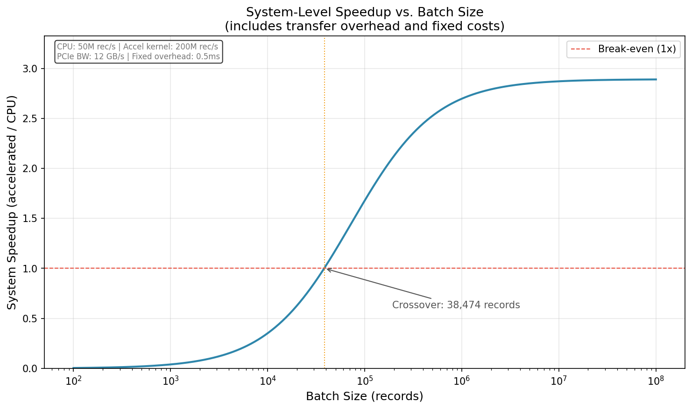

# Trade-Off Analysis: CPU vs. FPGA Bitfield Packing

## 1. Kernel Performance (The Optimistic View)

The packing kernel is an ideal FPGA candidate on paper:

- **Fully deterministic:** No branching, no data-dependent control flow.
- **Parallelizable:** Each record is independent.
- **Pipelineable:** With `#pragma HLS PIPELINE II=1`, the FPGA can start processing a new record every clock cycle (after the pipeline fills).
- **Compact:** The entire kernel fits easily in a fraction of a modern FPGA's resources.

**Estimated kernel throughput:**

| Platform | Mechanism | Estimated Throughput |
|---|---|---|
| CPU (single-core, -O3) | Sequential loop | ~20–60 M records/sec (varies by CPU) |
| CPU (SIMD, 4-wide AVX2) | Vectorized packing | ~80–200 M records/sec |
| CPU (multithreaded, 8 cores) | Parallel batches | ~160–480 M records/sec |
| FPGA (HLS, II=1, 200 MHz) | Pipelined stream | ~200 M records/sec |

**The naive conclusion:** The FPGA is competitive with but not dramatically faster than a well-optimized CPU for this kernel. This is already informative — for simple kernels, CPU optimization often closes the gap.

## 2. System-Level Performance (The Realistic View)

The kernel throughput numbers above are measured (or estimated) in isolation. In a real system, the FPGA path includes overhead that does not appear in kernel benchmarks.

**For a batch of 1M records on a PCIe-attached FPGA:**

```
Input data size:  1M records × 8 fields × 2 bytes = 16 MB
Output data size: 1M records × 7 bytes = 7 MB
Total transfer:   23 MB

PCIe Gen3 x16 theoretical: ~16 GB/s
PCIe Gen3 x16 practical:   ~12 GB/s (with protocol overhead)
Transfer time (one-way):    ~1.3 ms (16 MB at 12 GB/s)
Round-trip transfer:        ~1.9 ms

Kernel compute (at 200 MHz, II=1): ~5 ms
DMA setup + synchronization:       ~0.2–0.5 ms

Total FPGA path: ~7.1–7.4 ms
```

**Effective system throughput: ~135–140 M records/sec**

Compare this to the CPU baseline of 20–60 M records/sec (single-core) or 160–480 M records/sec (optimized multi-core). The FPGA's kernel advantage is substantially eroded by transfer overhead.

**The honest conclusion:** For a batch-processed, PCIe-attached FPGA, the system-level speedup over a single CPU core is ~2–7x. Over an optimized multi-core CPU implementation, the FPGA may actually be *slower*.

## 3. Integration Cost (What the Numbers Don't Show)

The analysis above considers only runtime performance. The full picture includes:

| Cost | CPU Path | FPGA Path |
|---|---|---|
| Implementation time | Days | Weeks to months |
| Debugging tools | Standard (gdb, perf, valgrind) | Vendor-specific (Vivado, ILA) |
| CI/CD | Standard build pipeline | + bitstream build, device testing |
| Failure modes | Standard (segfault, OOM) | + driver crash, DMA timeout, thermal |
| Observability | Full (any profiler) | Custom instrumentation required |
| Fallback | N/A (it is the fallback) | Must maintain CPU path in parallel |
| Team requirement | General C/systems engineer | + HLS/FPGA specialist |
| Deployment | Any Linux server | Requires FPGA-equipped instance |

Even if the FPGA delivers a meaningful speedup, the integration cost must be amortized over enough compute savings to justify itself. For a packing kernel that runs in milliseconds, the break-even point is very high.

## 4. When the FPGA Wins

The analysis above is deliberately unfavorable to the FPGA — and intentionally so, because most acceleration proposals understate integration costs. But there are scenarios where the calculus reverses:

### Scenario A: Inline (streaming) acceleration

If the FPGA sits in the network data path — receiving data directly from a NIC and emitting packed output without host CPU involvement — the transfer overhead disappears entirely. This is where FPGAs deliver their most compelling value in data infrastructure.

### Scenario B: Volume that exhausts CPU scaling

If the pipeline processes not 1M but 10B records per batch, and CPU scaling hits a wall (core count × memory bandwidth), the FPGA's throughput ceiling becomes relevant. At extreme volumes, the integration cost amortizes over enough compute savings to justify itself.

### Scenario C: Deterministic latency requirements

If the pipeline has a hard latency budget (not "fast" — hard, as in "must complete within N microseconds, worst-case"), the FPGA's deterministic execution model offers guarantees that CPUs and GPUs cannot. Worst-case CPU latency is affected by cache misses, context switches, and GC pauses. Worst-case FPGA latency is a function of the pipeline depth and clock frequency — both known at synthesis time.



The crossover point depends entirely on the specific workload, infrastructure cost model, and team composition. There is no universal threshold. Use [`tools/crossover_analysis.py`](../../tools/crossover_analysis.py) to explore the trade-offs with your own numbers.

## 5. Summary

| Dimension | CPU (Optimized) | FPGA (Batch, PCIe) | FPGA (Inline/Stream) |
|---|---|---|---|
| Kernel throughput | 20–200 M rec/s | ~200 M rec/s | ~200 M rec/s |
| System throughput (1M batch) | 20–480 M rec/s | ~135–140 M rec/s | ~200 M rec/s |
| Integration effort | Low (days) | High (months) | High (months) |
| Failure modes | Standard | Many new | Many new |
| Observability | Full | Requires investment | Requires investment |
| Team requirement | General SWE | FPGA + SWE | FPGA + SWE + network |
| Vendor dependency | None | Toolchain + runtime | Toolchain + runtime + NIC |

The example demonstrates that even for a workload that is theoretically ideal for FPGA acceleration, the system-level return must be weighed against integration cost, operational complexity, and the availability of simpler alternatives.

**The right question is not "Is the FPGA faster?" — it is "Is the FPGA faster *enough* to justify everything it costs to integrate, operate, and maintain?"**

For most data pipelines, the answer is no. For a specific subset — high-volume, stable-logic, inline-processing workloads — the answer is yes.

---

*This analysis accompanies the [cpu-vs-fpga-bitpack example](README.md) in the [hardware-acceleration-in-data-pipelines](../../README.md) repository.*
